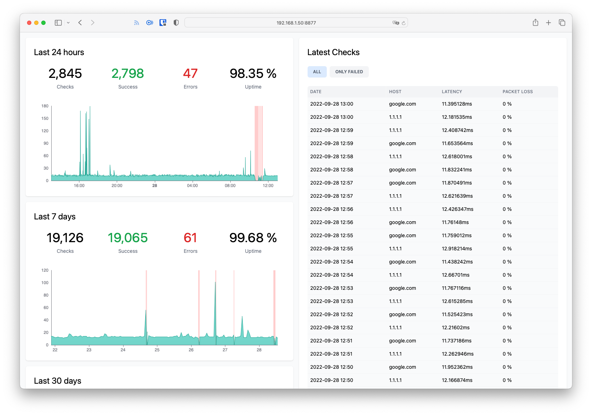

# Sprinter



## Features

- Monitor network uptime
- Pings & Speed test

Built with [Go](https://go.dev/) and [SQLite](https://sqlite.org/).

## Docker

#### Build

```shell
docker build -t sprinter:latest .
```

#### Run

```shell
docker run \
  -v "$(pwd)/data.db:/data.db" \
  -v "$(pwd)/.env:/.env" \
  -p 8080:8080 \
  sprinter:latest
```

## Development

### Requirements

- Go 1.19+
- Yarn
- _Docker_

### Go app

#### Install dependencies

```
go mod download
```

#### Build & hot reload

```shell
gow -e=go,html run .
```

### Frontend

#### Install dependencies

```
yarn install
```

#### Build & hot reload

```shell
yarn watch
```

## Troubleshooting

**macOS**: You will need to run the executable as root and enable privileged mode by setting `PING_PRIVILEGED` to true.

## License

Released under the [MIT License](LICENSE.md).

## Authors

- [Roman Zipp](https://github.com/romanzipp)
